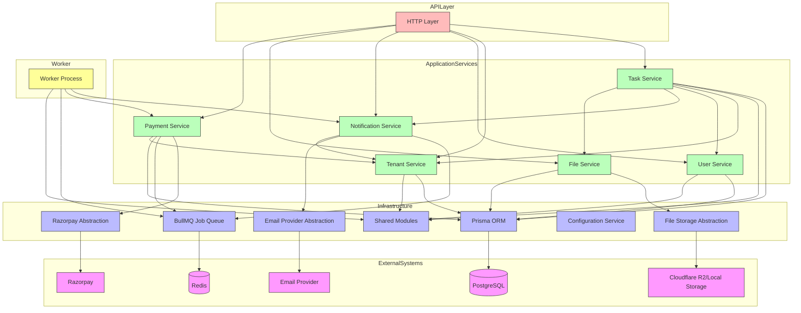

# System Components

This document details the responsibilities, interfaces, dependencies, and knowledge boundaries of each system component in the TaskFlow API.

## Components

### HTTP Layer
**Responsibility**: Handles all HTTP concerns including routing, request parsing, authentication middleware, authorization checks, input validation, calling application services, HTTP status codes, response serialization, and OpenAPI integration.

**Public Interface**: 
- REST API endpoints under `/api/v1/`
- OpenAPI specification endpoint
- Health check endpoints

**Dependencies**: 
- Application Services (TaskService, TenantService, etc.)
- Shared validation and authentication utilities
- Configuration service

**Must NOT know about**: 
- Database schema details
- Prisma ORM internals
- Background job implementation
- External service APIs (email, payment, storage)
- Business logic of task management

### Task Service
**Responsibility**: Manages task lifecycle operations including creation, retrieval, updating, deletion, assignment, validation of task-related business rules, and publishing task assignment events.

**Public Interface**: 
- Methods: createTask, getTask, updateTask, deleteTask, assignTask
- Event publishing: task.assigned

**Dependencies**: 
- Task Repository
- Tenant Service (for tenant validation)
- User Service (for assignee validation)
- Notification Service (via event publishing)
- File Service (for attachment handling)

**Must NOT know about**: 
- HTTP request/response details
- Authentication implementation
- Background job worker implementation
- Email provider specifics
- Payment provider implementation
- File storage implementation details

### Tenant Service
**Responsibility**: Manages tenant provisioning, user-tenant mapping, and tenant-level operations.

**Public Interface**: 
- Methods: createTenant, getTenant, getUserTenant, addUserToTenant, removeUserFromTenant
- Tenant validation and resolution

**Dependencies**: 
- Tenant Repository
- User Repository

**Must NOT know about**: 
- HTTP layer concerns
- Specific task or notification business rules
- Background job processing
- Payment provider integration
- File storage mechanisms

### User Service
**Responsibility**: Manages user profile operations and authentication-related user data.

**Public Interface**: 
- Methods: createUser, getUser, updateUser, authenticateUser
- Password validation and hashing utilities

**Dependencies**: 
- User Repository
- Authentication utilities

**Must NOT know about**: 
- Task management logic
- Notification sending
- Payment processing
- File storage details
- Background job queuing

### Notification Service
**Responsibility**: Handles the queuing and delivery of notifications (primarily email) for events like task assignments.

**Public Interface**: 
- Methods: sendNotification, processNotificationQueue
- Event subscription: task.assigned

**Dependencies**: 
- Email Provider abstraction
- Notification Repository (for tracking sent notifications)
- BullMQ queue interface

**Must NOT know about**: 
- HTTP request handling
- Task business logic
- Payment processing
- File storage mechanisms
- Database schema details (beyond notification entities)

### File Service
**Responsibility**: Manages file uploads, validation, storage, and metadata persistence for attachments.

**Public Interface**: 
- Methods: uploadFile, getFile, deleteFile, getFileMetadata
- Validation: file size (<10MB), MIME type, tenant authorization

**Dependencies**: 
- File Storage abstraction (Cloudflare R2/Local)
- Attachment Repository
- Tenant validation
- Authentication

**Must NOT know about**: 
- HTTP layer parsing details
- Task business logic
- Notification sending
- Payment processing
- Background job worker implementation

### Payment Service
**Responsibility**: Handles payment processing, subscription management, and webhook handling for Razorpay integration.

**Public Interface**: 
- Methods: createSubscription, getSubscriptionStatus, processWebhook
- Event publishing: subscription.updated, payment.failed

**Dependencies**: 
- Razorpay provider abstraction
- Subscription Repository
- Webhook validation utilities
- Tenant Service (for subscription-tenant linking)

**Must NOT know about**: 
- HTTP layer concerns
- Task management logic
- Notification sending
- File storage implementation
- Background job worker details

### Prisma ORM
**Responsibility**: Provides type-safe database access, query building, transaction management, schema management, and migrations.

**Public Interface**: 
- PrismaClient instance with model methods (find, create, update, delete)
- Transaction API ($transaction)
- Migration commands

**Dependencies**: 
- PostgreSQL database connection
- Schema definition files

**Must NOT know about**: 
- HTTP layer concerns
- Business logic of any service
- Background job implementation
- External service integrations
- Authentication mechanisms

### Job Queue (Redis/BullMQ)
**Responsibility**: Manages background job queuing, processing, retry mechanisms, and failed job handling for notifications and payment retries.

**Public Interface**: 
- Queue API: addJob, processJobs, retryFailedJobs
- Event listeners for job completion/failure

**Dependencies**: 
- Redis connection
- Job processor implementations (email worker, payment retry worker)

**Must NOT know about**: 
- HTTP request handling
- Task business logic specifics
- Payment provider APIs
- File storage details
- Database schema beyond job metadata

### Worker Process
**Responsibility**: Executes background jobs from the queue, handling notifications and payment-related asynchronous tasks.

**Public Interface**: 
- Job processing functions for each job type
- Graceful shutdown handling

**Dependencies**: 
- Job Queue interface
- Notification Service (for email sending)
- Payment Service (for retry logic)
- Email Provider
- Storage abstractions (if needed for job context)

**Must NOT know about**: 
- HTTP layer concerns
- REST API routing
- Request validation logic
- OpenAPI specification
- Direct database access (should use services)

### Email Provider Abstraction
**Responsibility**: Defines the interface for sending emails, allowing provider swapping without changing business logic.

**Public Interface**: 
- Method: send(options: SendEmailOptions): Promise<void>

**Dependencies**: 
- Actual email provider implementation (SMTP, SendGrid, etc.) in infrastructure

**Must NOT know about**: 
- HTTP layer
- Task business logic
- Payment processing
- File storage
- Queue implementation details

### File Storage Abstraction
**Responsibility**: Defines the interface for file storage operations, enabling swap between local (dev) and Cloudflare R2 (prod).

**Public Interface**: 
- Methods: upload(file), download(key), delete(key), getUrl(key)

**Dependencies**: 
- Cloudflare R2 SDK or local filesystem implementation

**Must NOT know about**: 
- HTTP layer concerns
- Task business logic
- Notification sending
- Payment processing
- Queue implementation

### Razorpay Abstraction
**Responsibility**: Defines the interface for Razorpay payment provider interactions, encapsulating provider-specific details.

**Public Interface**: 
- Methods: createOrder, verifyPayment, fetchSubscription, handleWebhook

**Dependencies**: 
- Razorpay Node.js SDK
- Webhook signature verification

**Must NOT know about**: 
- HTTP layer concerns
- Task business logic
- Notification sending
- File storage
- Queue implementation details
- Database schema (beyond payment entities)

### Configuration Service
**Responsibility**: Manages application configuration from environment variables and provides typed access to settings.

**Public Interface**: 
- Methods: get(key), getBoolean(key), getNumber(key), getObject(key)
- Validation of required configuration

**Dependencies**: 
- Environment variables
- Optional configuration files

**Must NOT know about**: 
- HTTP layer concerns
- Business logic of any service
- Database connections
- External service implementations

### Shared Modules (Errors, Logging, Validation, Tenancy)
**Responsibility**: Provides cross-cutting concerns used throughout the application.

**Public Interface**: 
- Error classes (ValidationError, AuthenticationError, etc.)
- Logging utilities
- Validation schemas and functions
- Tenant context helpers

**Dependencies**: 
- Minimal (mostly standard libraries)

**Must NOT know about**: 
- Specific business logic of services
- HTTP framework details
- Database implementation
- External service APIs

## Component Dependency Diagram

